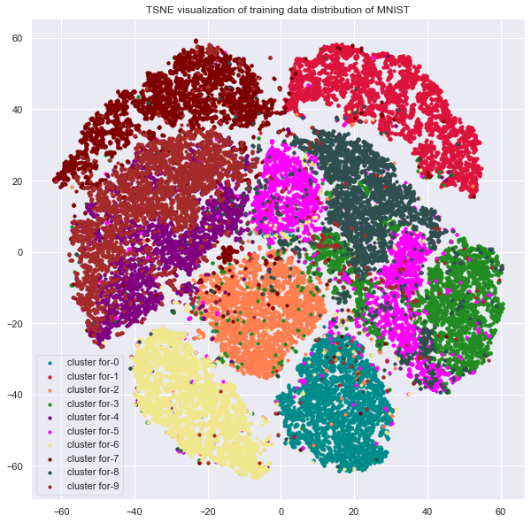

# Auto-Encoder
Auto-Encoders are powerful tool for Deep Learning based Pattern recognition. Here this repository not only contains autoencoder model but also shows a way for image clustering using Hidden features of Encoder model. The graph shows 

# Image clustering results on MNIST

